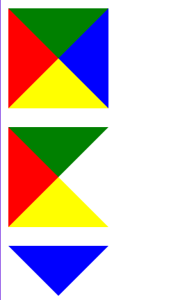
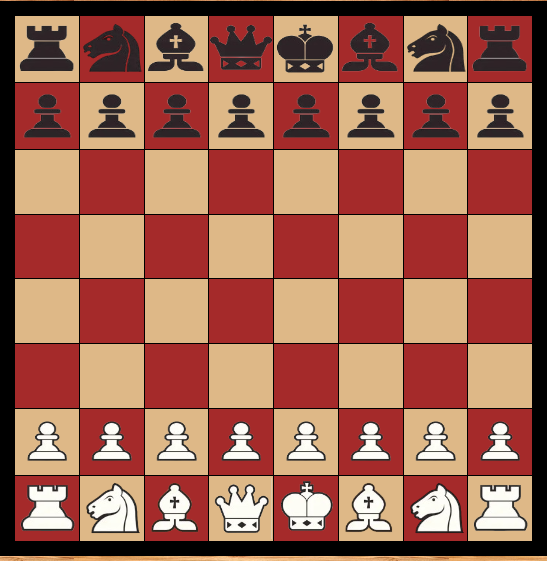
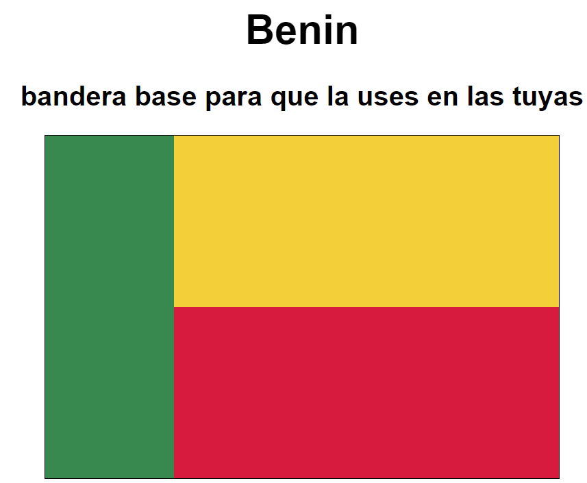
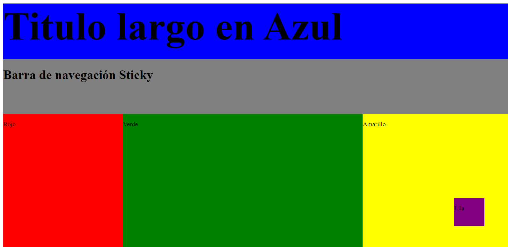

# Guión sobre el repositorio de Luis Hidalgo

## Repositorio de Lenaguaje de Marcas

### 1. Tema 08:
- En el tema 8 hicimos...
- También hicimos un ejercicio de actividad de dibujos con varias figuras.
    ```markdown
    [Figuras](tema08/actividad_dibujos/)

- Y para finalizar un trabajo de realizar varios tableros de ajedrez con diferentes métodos.
    ```markdown
    [Ajedrez](tema08/ajedrez/ajedrez.html/)


### 2. Tema 09:
- En el tema 9 hicimos...
- Una actividad de realizar banderas con css, aquí algún ejemplo
    ```markdown
    [Banderas](tema09/banderas/)


- También realizamos una actividad de posicionamientos
   ```markdown
    [Banderas](tema09/posicionamientos/)


# Conclusiones
Esté es el repositorio de clase de Luis Hidalgo Santiago alumno de 1º de DAW en Medac.